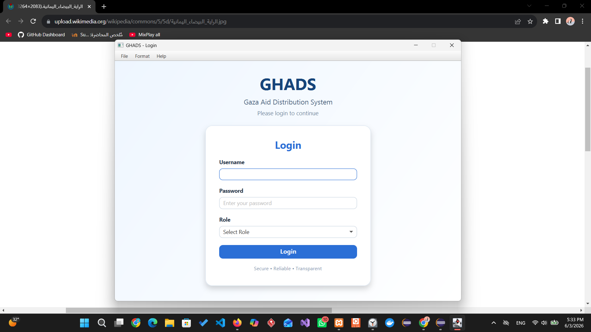
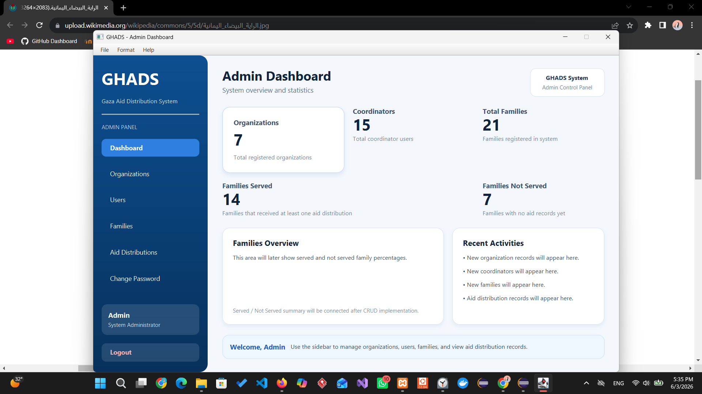
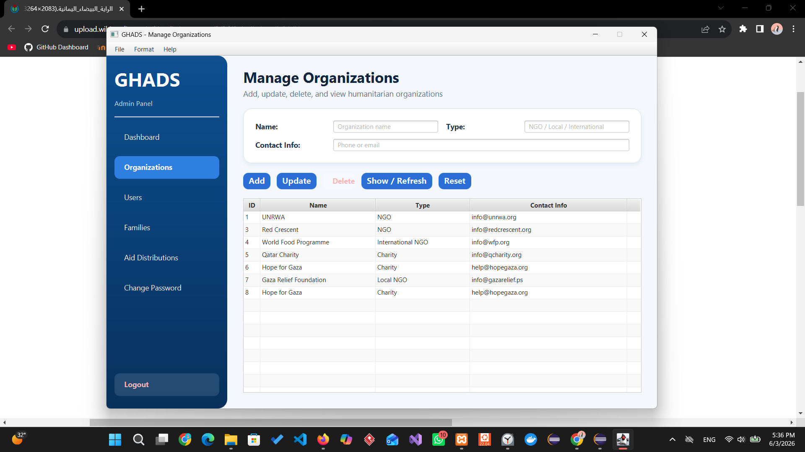
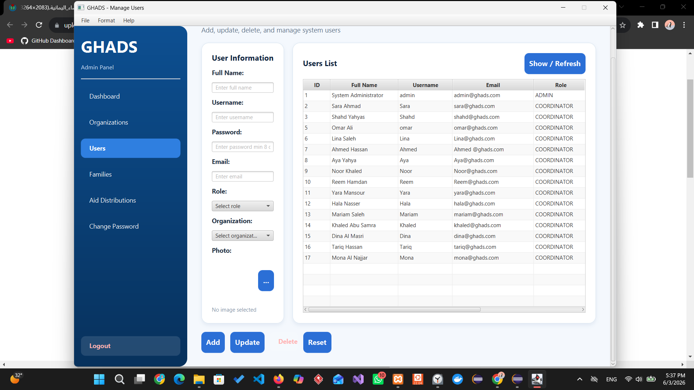
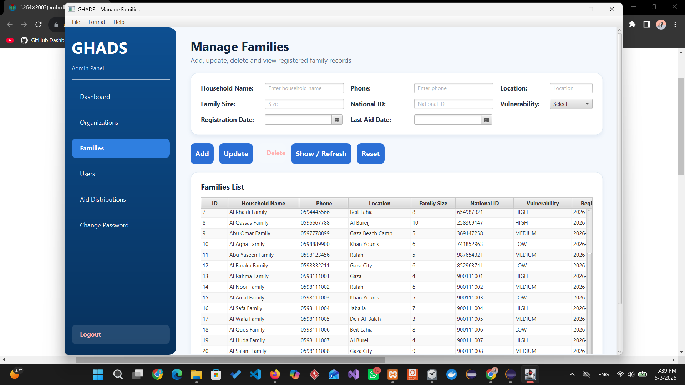
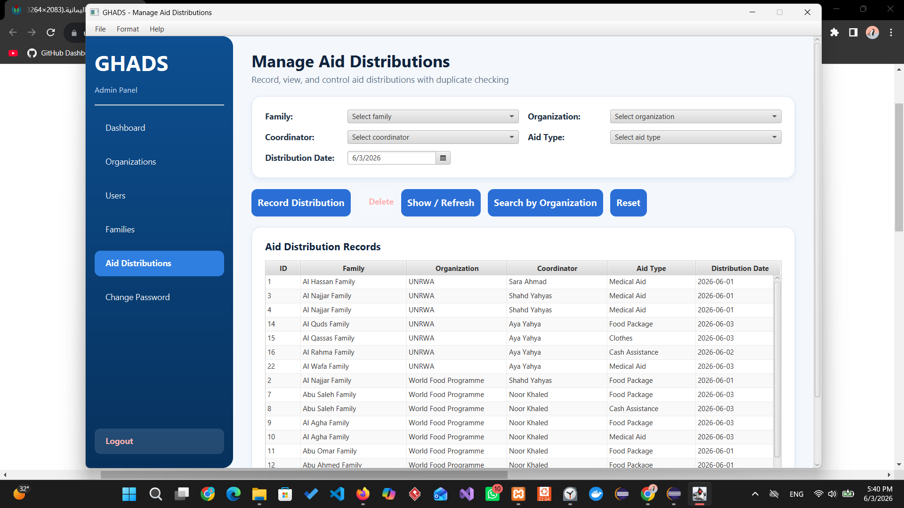
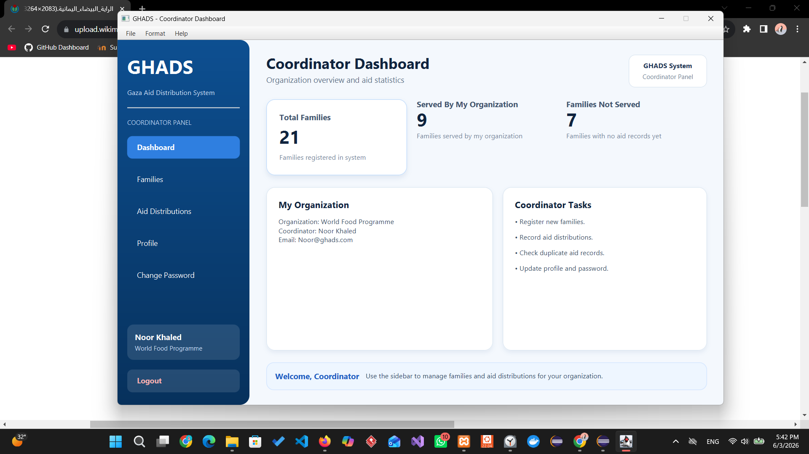
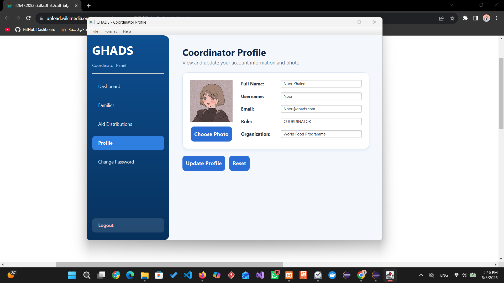

# GHADS
## Gaza Humanitarian Aid Distribution System

GHADS is a centralized desktop application developed to support humanitarian organizations in Gaza in coordinating aid distribution and preventing duplicate assistance to displaced families.

---

# Project Purpose

The purpose of GHADS is to provide a shared platform where multiple humanitarian organizations can work together using one centralized database.

The system ensures that aid reaches beneficiaries fairly and transparently while reducing duplication and improving coordination between organizations.

---

# Problem Statement

When humanitarian organizations operate independently, the same family may receive aid multiple times while other families receive no assistance at all.

This lack of coordination creates unfair distribution of resources and reduces the effectiveness of humanitarian efforts.

GHADS addresses this problem by maintaining a shared beneficiary database and automatically checking aid history before recording new distributions.

---

# System Objectives

- Register displaced families in a centralized database.
- Record aid distributions across organizations.
- Prevent duplicate aid distributions.
- Identify families that have not received assistance.
- Support role-based access control.
- Provide meaningful dashboards and statistics.
- Improve transparency and fairness in humanitarian aid delivery.

---

# System Users

## Admin

The administrator can:

- Login to the system
- Manage organizations
- Manage users
- Manage families
- Manage aid distributions
- View system-wide statistics
- Change password
- Logout

---

## Coordinator

The coordinator can:

- Login to the system
- View organization dashboard
- Register new families
- Search high vulnerability families
- Search families not yet served
- Record aid distributions
- Manage profile information
- Change password
- Logout

---

# Main Features

- Authentication System
- Organization Management (CRUD)
- User Management (CRUD)
- Family Management (CRUD)
- Aid Distribution Management
- Dashboard Statistics
- Duplicate Aid Detection
- High Vulnerability Search
- Not Served Families Search
- Profile Management
- Password Management
- Theme Switching
- Font Customization

---

# Duplicate Aid Prevention Logic

Before recording a new aid distribution, the system automatically checks the family's aid history.

### HIGH Vulnerability

- Aid distribution is always allowed.

### MEDIUM and LOW Vulnerability

- If the family has already received aid within the previous 30 days:
  - The distribution is rejected.
  - An alert is displayed showing:
    - Family Name
    - Vulnerability Level
    - Organization Name
    - Distribution Date

This mechanism helps ensure fair aid distribution across beneficiaries.

---

# Technologies Used

## Programming Language

- Java

## User Interface

- JavaFX
- Scene Builder
- CSS

## Database

- MySQL

## Database Connectivity

- JDBC

## Development Environment

- Eclipse IDE

## Version Control

- Git
- GitHub

---

# Software Architecture

The project follows the following design patterns:

## MVC (Model - View - Controller)

- Models represent application data.
- Views are implemented using JavaFX FXML screens.
- Controllers handle user interaction and application logic.

## DAO (Data Access Object)

All database operations are implemented through DAO classes:

- UserDAO
- OrganizationDAO
- FamilyDAO
- AidDistributionDAO

## Singleton Pattern

The Singleton pattern is implemented in:

- DBConnection

This ensures a single shared database connection throughout the application.

---

# Database Tables

The system uses the following database tables:

- users
- organizations
- families
- aid_distributions

---

# Screenshots

## Login Screen

---

## Admin Dashboard

---

## Organization Management

---

## User Management

---

## Family Management

---

## Aid Distribution Management

---

## Coordinator Dashboard

---

## Coordinator Profile

---

# Future Improvements

- PDF Reports Export
- Email Notifications
- Multi-language Support
- Cloud Database Integration
- Advanced Analytics Dashboard

---

# Developer

**Shahd Abo Kwaik**

Programming III Lab Project

2026